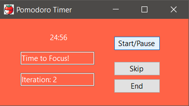

# Pomodoro Timer App



## Description

The Pomodoro Timer App is a simple Windows Forms application written in C# that helps users manage their work and break intervals using the Pomodoro Technique.

Pomodoro technique that improve your productivity, concentration and attention to completing tasks.

## Features

- Start, pause, skip, and end sessions buttons.
- Textual feedback on the current session status.
- Track the number of completed iterations.
- Sound notification when pomodoro change status work/rest.

- Work Pomodoro - 25 minutes.
- Rest Pomodoro - 5 minutes.

## To Do

- [ ] Implement setting customizable work and break durations.
- [ ] Design GUI, Timer, View mode for application.
- [ ] Implement a long break after every 8 iterations.
- [ ] White noise background sound.
- [ ] First click start and Continue/Stop button implementation.
- [ ] Add text to Focus Note/Task status.
- [ ] Increment and Decrement time of Pomodoro
- [ ] Features that pin pomodoro windows to top of screen with one click.

## Getting Started

### Prerequisites

- .NET Framework
- Visual Studio (or any C# development environment)

### Installation

Executable file path: `PomodoroTimerApp\bin\Debug\net6.0-windows\PomodoroTimerApp.exe`
Start exe file: `PomodoroTimerApp.exe`

1. Clone the repository:

    ```bash
    git clone https://github.com/dotpep/pomodoro-winforms.git
    ```

2. Open the project in Visual Studio (project solution: `PomodoroTimerApp.sln`).

3. Build and run the application (CTRL + F5, in Visual Studio).

## Usage

1. Set your desired work and break durations.
2. Click the "Start/Pause" button to start or pause the Pomodoro session.
3. Click the "Skip" button to move to the next Pomodoro session.
4. Click the "End" button to stop the current session.

## Contributing

Contributions are welcome! If you find any issues or have suggestions, please open an issue or submit a pull request.

## License

This project is licensed under the [MIT License](LICENSE).

## Acknowledgments

- [Pomodoro Technique](https://en.wikipedia.org/wiki/Pomodoro_Technique)
